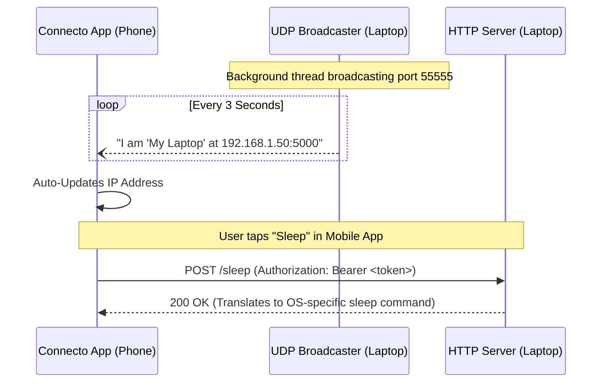

<div align="center">

# 🚀 Stitch Agent for Connecto

**The seamless, cross-platform bridge between your mobile device and your computer.**

[](https://python.org)
[](https://flask.palletsprojects.com/)
[](https://github.com/RamXCat/Connecto)
[](https://opensource.org/licenses/MIT)

### 📱 [Download the Connecto Mobile App Here](https://bit.ly/3Qi1hps) 📱

[Features](#-key-features) • [Architecture](#-how-it-works) • [Installation](#-quickstart) • [API](#-api-reference) • [Configuration](#-configuration)

</div>

---

## 📖 Overview

**Stitch Agent** is a lightweight, zero-configuration background daemon that runs on your local machine. It allows the **Connecto Mobile App** to discover your laptop on the local network automatically and execute secure, authorized system commands (Shutdown, Sleep, Restart, Lock).

By utilizing a hybrid **UDP/HTTP architecture**, Stitch completely eliminates the need for manual IP configuration.

---

## ✨ Key Features

| Feature | Description |
| :--- | :--- |
| **📡 Auto-Discovery** | UDP broadcaster announces your IP every 3 seconds. The app finds your PC instantly, even if your router assigns a new IP. |
| **🔒 Zero-Trust Security** | All endpoints are protected via strict Bearer Token authentication. |
| **🌙 Soft Sleep (Windows)** | Intelligently turns off the display monitor instead of suspending the OS, keeping the server alive to wake it up later. |
| **☀️ Magic Wake-Up** | Pinging the server simulates a micro hardware event, instantly waking your monitors from sleep. |
| **💻 True Cross-Platform** | Native system calls tailored perfectly for Windows, macOS, and Linux. |
| **👻 Silent Background Service** | Built-in setup scripts configure the agent to boot silently with your OS. |

---

## 🧠 How It Works



---

## 🚀 Quickstart

### 1. Clone the Repository
```bash
git clone https://github.com/RamXCat/Connecto.git
cd Connecto
```

### 2. Set Your Secret Token
Open `config.py` and change the `SECRET_TOKEN`. This token must match the one entered in your Connecto App.
```python
SECRET_TOKEN = "your-secure-passphrase-here"
```

### 3. Install Dependencies
```bash
pip install -r requirements.txt
```

### 4. Enable Auto-Start (Recommended)
Configure the agent to boot completely silently in the background whenever you turn on your machine.
```bash
python setup/setup.py
```
*(Supports Windows, macOS, and Linux out of the box).*

---

## 🛠️ API Reference

Stitch Agent exposes a secure REST API on port `5000`. 
**Requirement:** All requests must include the header `Authorization: Bearer <SECRET_TOKEN>`.

| Endpoint | Method | Action | Platform Behavior |
| :--- | :---: | :--- | :--- |
| `/status` | `GET` | Verifies connection | Returns `{"status": "online"}` & wakes up monitors |
| `/sleep` | `POST` | Sleep system | **Win:** Powers off monitor. **Mac/Linux:** Suspend |
| `/shutdown`| `POST` | Shutdown system | Executes native graceful shutdown |
| `/restart` | `POST` | Reboot system | Executes native graceful reboot |
| `/lock` | `POST` | Lock Workstation | Returns to login screen |

---

## ⚙️ Configuration

Modify `config.py` to tailor the agent to your network:

| Variable | Default | Description |
| :--- | :--- | :--- |
| `DEVICE_NAME` | `"My Laptop"` | The display name broadcasted to the Connecto app. |
| `HTTP_PORT` | `5000` | The port the command receiver listens on. |
| `BROADCAST_PORT` | `55555` | The UDP port used for LAN discovery broadcasts. |
| `BROADCAST_INTERVAL`| `3` | Seconds between UDP IP announcements. |

---

<div align="center">
  <p>Built with ❤️ for seamless cross-device connectivity.</p>
  <p>
    <a href="https://github.com/RamXCat/Connecto/issues">Report Bug</a>
    ·
    <a href="https://github.com/RamXCat/Connecto/issues">Request Feature</a>
  </p>
</div>
