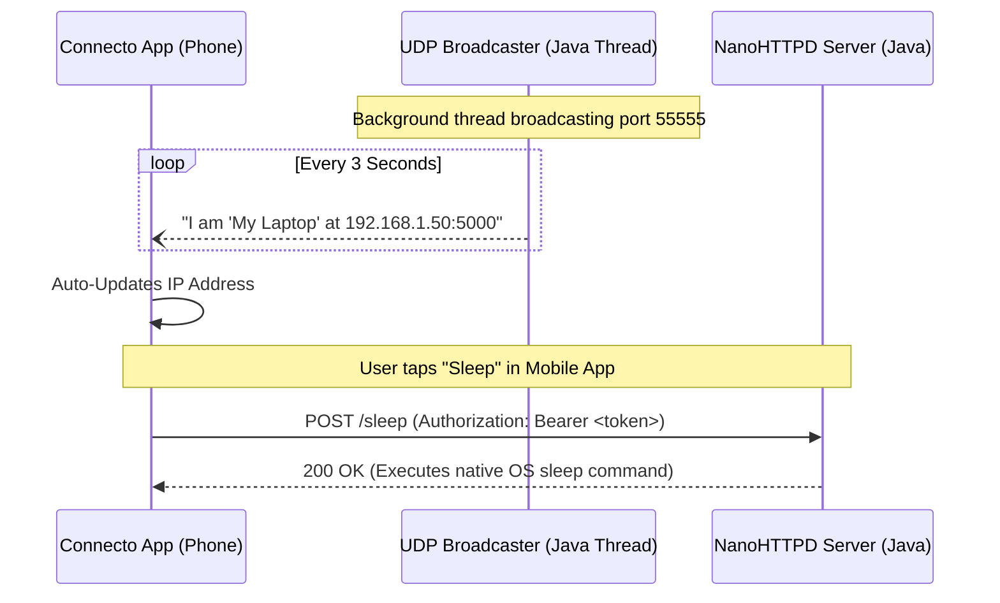

<div align="center">

# 🚀 Stitch Agent for Connecto

**The seamless, zero-dependency Java bridge between your mobile device and your computer.**

[](https://oracle.com/java)
[](https://openjfx.io/)
[](https://github.com/RamXCat/Connecto)
[](https://opensource.org/licenses/MIT)

### 📱 [Download the Connecto Mobile App Here](https://bit.ly/3Qi1hps) 📱

[Features](#-key-features) • [Architecture](#-how-it-works) • [Installation](#-quickstart) • [Configuration](#-configuration)

</div>

---

## 📖 Overview

**Stitch Agent** is a lightweight, zero-configuration background daemon and graphical interface running on your local machine. It allows the **Connecto Mobile App** to discover your laptop on the local network automatically and execute secure, authorized system commands (Shutdown, Sleep, Restart, Lock).

Recently upgraded from a Python script to a **100% Native JavaFX Desktop Application**, Stitch now features a gorgeous UI, real-time QR code generation, and zero dependencies required for the end user.

---

## ✨ Key Features

| Feature | Description |
| :--- | :--- |
| **📡 Auto-Discovery** | Custom Java UDP thread announces your IP every 3 seconds. The app finds your PC instantly. |
| **📱 1-Click QR Pairing** | Beautiful JavaFX UI generates an instant QR code for mobile pairing using ZXing. |
| **🔒 Zero-Trust Security** | All NanoHTTPD endpoints are protected via strict Bearer Token authentication. |
| **📦 Zero Dependencies** | Packaged via `jpackage`, the `.exe` bundles its own JRE. No Java installation needed! |
| **💻 Cross-Platform** | Native system `Runtime.exec` calls tailored perfectly for Windows, macOS, and Linux. |

---

## 🧠 How It Works



---

## 🚀 Quickstart

### 1. Clone the Repository
```bash
git clone https://github.com/RamXCat/Connecto.git
cd Connecto/java-fx-agent
```

### 2. Run Locally (Development)
Requires Maven and Java 17+.
```bash
mvn clean javafx:run
```

### 3. Build Standalone Executable (Windows)
Create a `.exe` file that doesn't require Java to run.
```bash
mvn clean package
jpackage --type app-image --name ConnectoAgent --input target --main-jar agent-1.0-SNAPSHOT.jar --main-class com.connecto.agent.Launcher --add-modules java.se,jdk.unsupported,jdk.charsets --icon ../logo/logo.ico --win-console
```
This will generate a `ConnectoAgent` folder containing your `.exe`!

---

<div align="center">
  <p>Built with ❤️ for seamless cross-device connectivity.</p>
  <p>
    <a href="https://github.com/RamXCat/Connecto/issues">Report Bug</a>
    ·
    <a href="https://github.com/RamXCat/Connecto/issues">Request Feature</a>
  </p>
</div>
